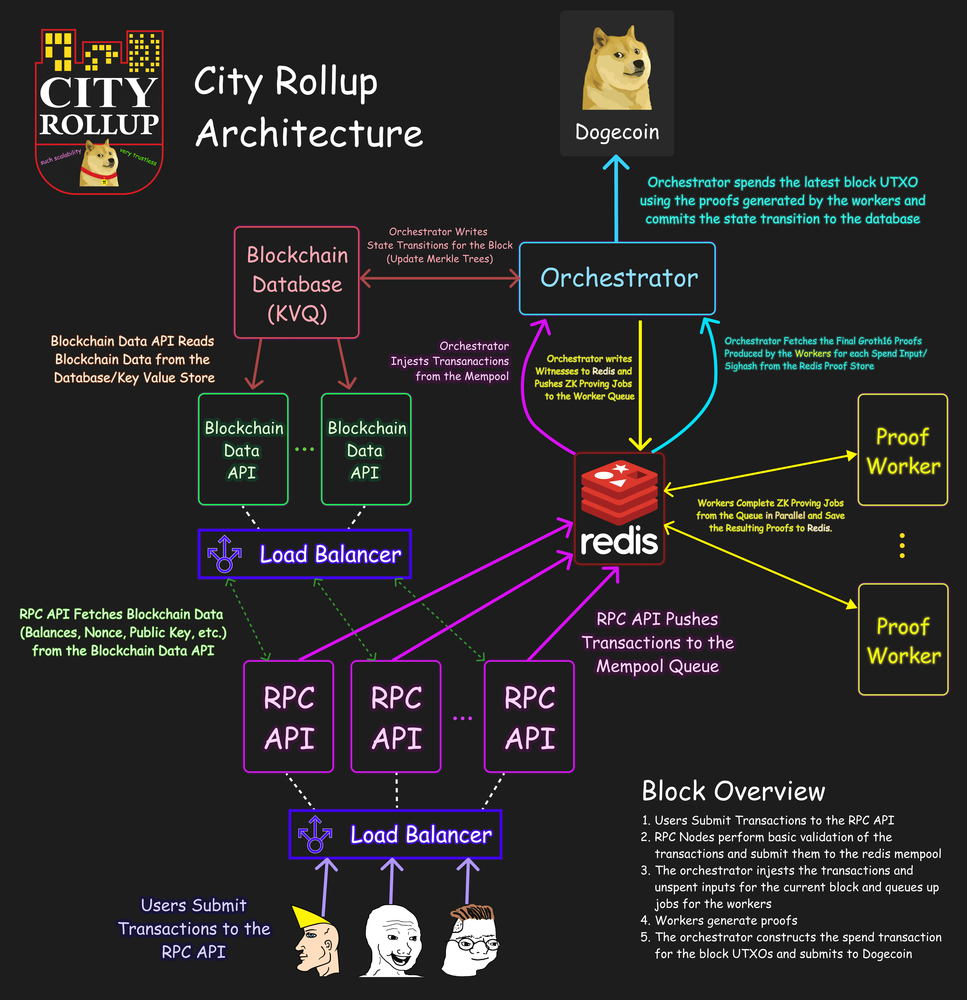

# Overview
CityRollup uses a massively parallel proving system that distributes proving tasks to workers who generate proofs to complete the block.

## Network Architecture

City Rollup's network architecture makes use of several different types of distributed nodes:
- RPC API Servers (Many)
  - The public facing servers users submit transactions to and can query for information such as user information (balance/public key)
- Blockchain Data API (Many)
  - Internal, IP filtered API servers that RPC API nodes use to query directly from the blockchain data store (co-located on the same server as the orchestrator)
- Orchestrator (One Per Rollup)
  - A queue processor that processes the transactions and state transitions for each block, as well as planning the jobs for proof workers.
  - At the end of each block, orchestrators also assemble the final transaction data for the block spend and submit to Dogecoin
- Proof Workers (Many)
  - Nodes which complete ZK proving jobs from the orchestrator
- Redis Cluster
  - City Rollup uses redis as a mempool, proof store and as a message queue to dispatch jobs to worker nodes.

## Massively Parallel Proving
City Rollup utilizes recursive proofs to generate block proofs in parallel:

import VideoCon from '@site/src/components/Video/VideoCon';

<VideoCon src="/video/arch-parallel-proving.mp4" />

In the animation above, you can see how proofs are proved in parallel to generate a single block transition proof in O(log(n)) time.