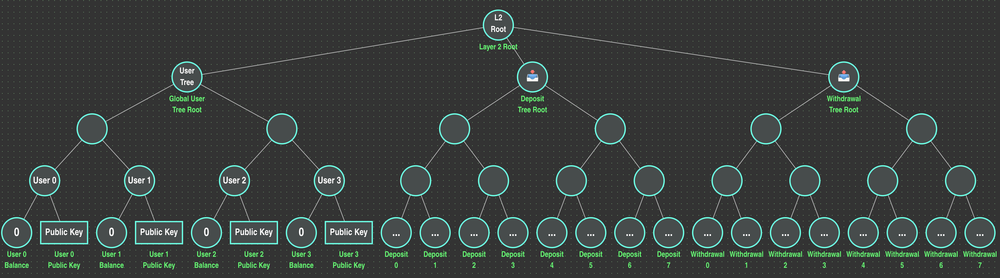
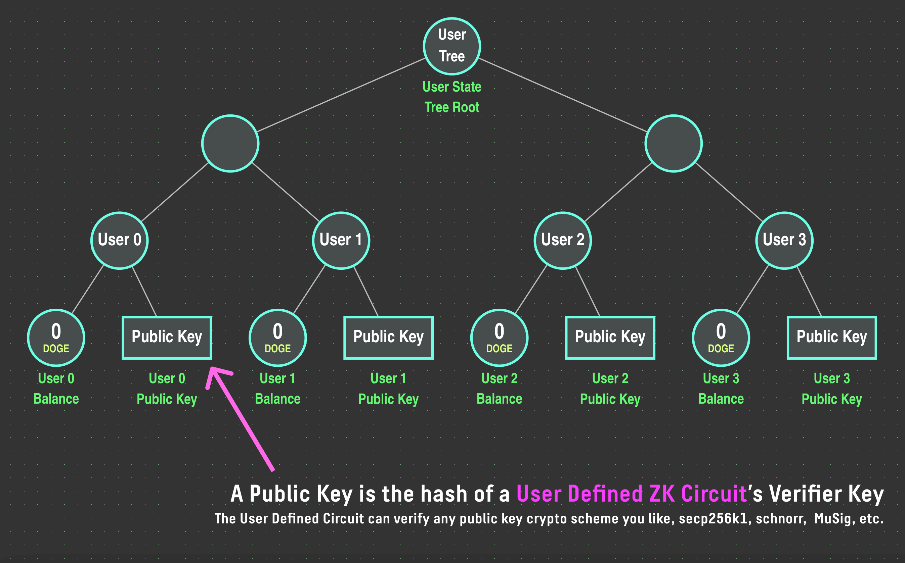
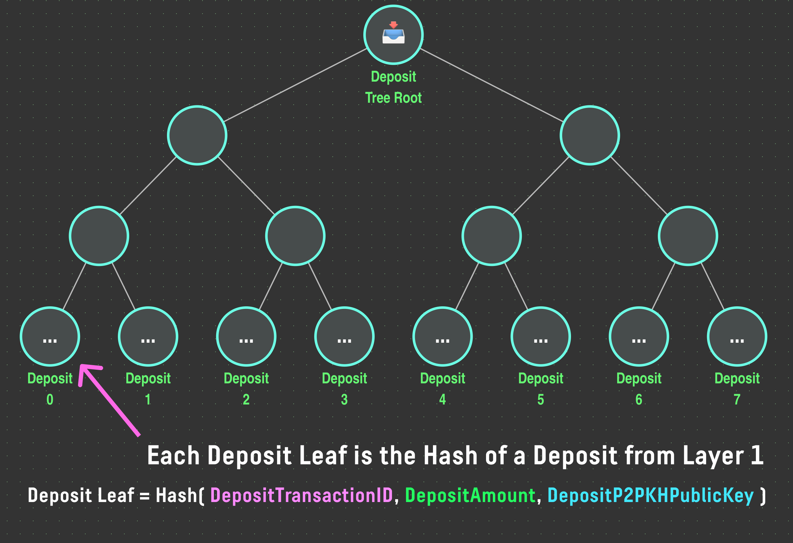
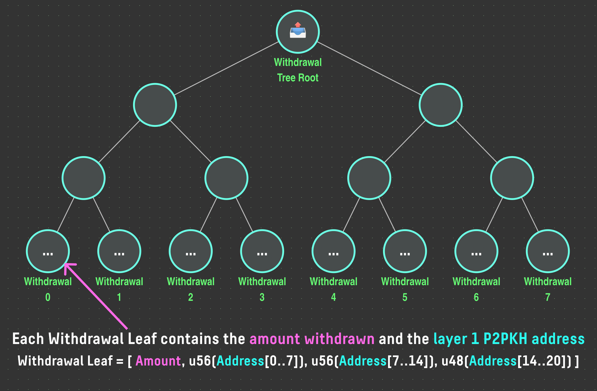

# State Model
City Rollup stores models state as merkle trees, each of which acts as a verifiable store for storing the state of the blockchain.


In the diagram above, we can see the 3 merkle trees that together hold the state of the rollup:
- User State Tree
  - Stores the users' balances and public keys
- Deposit Tree
  - Stores the hash of each deposit made into the rollup
- Withdrawal Tree
  - Stores the pending withdrawals for the rollup

### State Root
The state root of the rollup is the hash of the user state tree, deposit tree and withdrawal tree. 
Crucially, it is trivial to verify the value of any blockchain data in a city rollup block using a merkle proof.

The **state root** of the layer 2 is computed as follows:
```typescript
function computeL2StateRoot(userStateTreeRoot: Hash, depositTreeRoot: Hash, withdrawalTreeRoot: Hash) : Hash {
  return poseidonHash(poseidonHash(userStateTreeRoot, depositTreeRoot), withdrawalTreeRoot);
}
```


## User State Tree
The user state tree stores the token balance and public key for every user on the layer 2 (as well as a nonce):

Note that in the diagram above, the balance as shown as occupying an entire leaf, when in reality the first 64 bits of the leaf are used to store the balance and the next 64 bits are used to store the nonce.


## Deposit Tree
The deposit tree stores a deposit hash each time a user deposits DOGE on layer 1 into the rollup:

The deposit hash is computed as follows:
```typescript
function computeDepositHash(
  depositTransactionId: uint64[4], // The transaction id on dogecoin of the deposit transaction
  depositAmount: uint64, // The amount deposited in the rollup
  depositPublicKey: uint32[9], // The Dogecoin (Layer 1) secp256k1 public key of depositor 
) {
  let preimage = [
    depositTransactionId[0] & 0x00FFFFFFFFFFFFFFFF,
    depositTransactionId[1] & 0x00FFFFFFFFFFFFFFFF,
    depositTransactionId[2] & 0x00FFFFFFFFFFFFFFFF,
    depositTransactionId[3] & 0x00FFFFFFFFFFFFFFFF,
    depositAmount,
    depositPublicKey[0],
    depositPublicKey[1],
    depositPublicKey[2],
    depositPublicKey[3],
    depositPublicKey[4],
    depositPublicKey[5],
    depositPublicKey[6],
    depositPublicKey[7],
    depositPublicKey[8],
  ];
  return poseidonHash(preimage);
}
```
Note that the public key referenced is not the layer 2 public key, but instead the Dogecoin public key corresponding to the Dogecoin wallet address that sent the deposit. 

## Withdrawal Tree
The withdrawal tree stores all pending withdrawals to transfer tokens from layer 2 back to layer 1 (dogecoin).
Each withdrawal leaf encodes the amount to be withdrawn and the Dogecoin address that the withdrawal should be sent to:



The withdrawal leaves are encoded via the following pseudocode:
```typescript
function encodeWithdrawalLeaf(
  withdrawalAmount: u64, // the amount of $DOGE to be withdrawn (in sats)
  withdrawalAddress: byte[20], // the P2PKH address of the withdrawl recipient (same as hash160(doge_wallet_public_key))
) {

  let address_first_56_bits = withdrawalAddress[0]
                          | (withdrawalAddress[1] << 8)
                          | (withdrawalAddress[2] << 16)
                          | (withdrawalAddress[3] << 24)
                          | (withdrawalAddress[4] << 32)
                          | (withdrawalAddress[5] << 40)
                          | (withdrawalAddress[6] << 48);

  let address_next_56_bits = withdrawalAddress[7]
                          | (withdrawalAddress[8] << 8)
                          | (withdrawalAddress[9] << 16)
                          | (withdrawalAddress[10] << 24)
                          | (withdrawalAddress[11] << 32)
                          | (withdrawalAddress[12] << 40)
                          | (withdrawalAddress[13] << 48);

  let address_final_48_bits = withdrawalAddress[14]
                          | (withdrawalAddress[15] << 8)
                          | (withdrawalAddress[16] << 16)
                          | (withdrawalAddress[17] << 24)
                          | (withdrawalAddress[18] << 32)
                          | (withdrawalAddress[19] << 40);
  return [
    withdrawalAmount,
    address_first_56_bits,
    address_next_56_bits,
    address_final_48_bits,
  ];
}
```